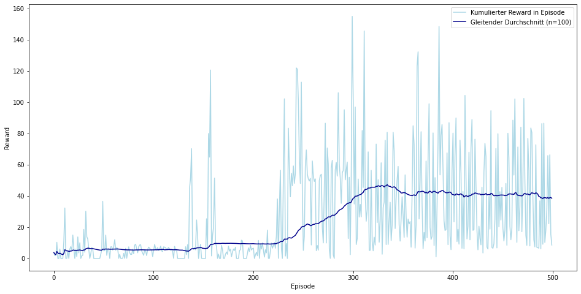
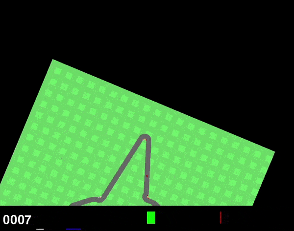
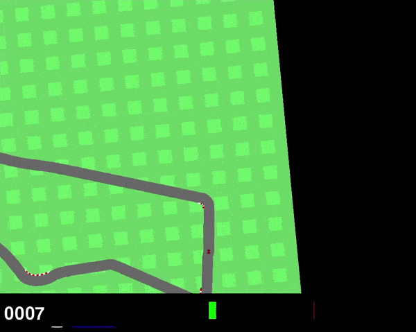
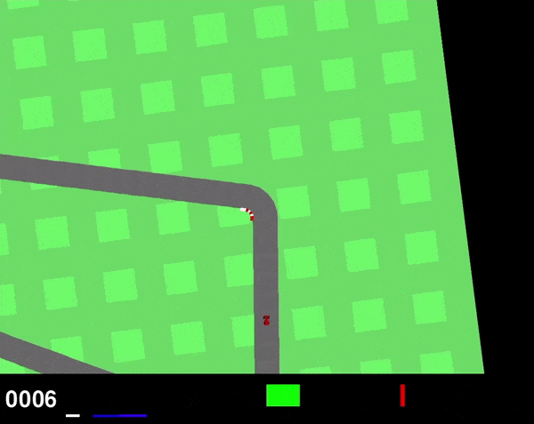

# Artificial Intelligence - Abgabe 3
Dieses Repository enthält den Code und die Ressourcen für die dritte Abgabe, die im 6. Semester im Rahmen des Kurses über Künstliche Intelligenz erstellt wurde. 
Der Schwerpunkt des Projekts liegt auf der Entwicklung und Implementierung eines Deep Q-Network (DQN) Agenten, der optimale Entscheidungen in einer Autorennumgebung aus der gymnasium-Bibliothek, früher bekannt als gym, trifft.

## Projektstruktur
Das Projekt ist in mehrere Ordner und Dateien gegliedert, die jeweils einem bestimmten Zweck dienen:

1. **agent/:** Dieser Ordner enthält die Implementierung des Deep Q-Network (DQN) Agenten. DQN ist ein beliebter Algorithmus für Reinforcement Learning, insbesondere in Szenarien, in denen die Zustands- und Aktionsräume groß und kontinuierlich sind.
2. **models/:** In diesem Ordner werden die Gewichte der trainierten DQN-Modelle gespeichert. Das Speichern der trainierten Modelle ermöglicht einen einfachen Zugriff für die Evaluation und zukünftige Verwendung.
3. **evaluation.ipynb:** Dieses Jupyter-Notebook wird verwendet, um die Leistung des trainierten DQN-Agenten zu bewerten. Es lädt die gespeicherten Modelle und lässt sie in der Rennumgebung laufen, um ihre Effektivität zu messen.
4. **training.ipynb:** Dieses Jupyter-Notebook ist für das Training des DQN-Agenten bestimmt. Das Notebook nutzt die Rennumgebung der gymnasium-Bibliothek, um den Agenten zu trainieren. 

## Erste Schritte

Zur Ausführung können die folgenden Schritte durchgeführt werden:

1. Klonen des Repository auf den lokalen Rechner:
````
git clone https://github.com/dschmtz/Abgabe-3-DQN.git
cd Abgabe-3-DQN-main
````

2. Installieren von erforderlichen Abhängigkeiten. Es wird empfohlen, eine virtuelle Umgebung einzurichten, um Konflikte zu vermeiden:
````
python -m venv venv
source venv/bin/activate   # On Windows, use: venv\Scripts\activate
pip install -r requirements.txt
````

3. Training des DQN-Agenten, indem das training Jupyter-Notebook ausgeführt wird. Dieses Notebook nutzt die Autorennumgebung, um den Agenten zu trainieren.

4. Evaluation des trainierten Agenten. Das Jupyter-Notebook zur Evaluation lädt die Gewichte mehrerer trainierter Agenten aus dem Modellordner und testet sie in der Autorennumgebung, um ihre Leistung zu vergleichen. Zudem dient es zur Visualisierungen der Ergebnisse, insbesondere des Reward.

## Umgebung

Die Reinforcement Learning Umgebung ist Teil der Box2D-Umgebungen der gymnasium-Bibliothek und simuliert ein Rennspiel aus der Vogelperspektive. 
- Der Aktionsraum in der Umgebung kann kontinuierlich oder diskret sein. Im kontinuierlichen Fall gibt es drei Aktionen: Lenken (von -1 für volle Linkskurve bis +1 für volle Rechtskurve), Gas geben und Bremsen. In der Implementierung wird dieser in einen diskreten Aktionsraum mit 12 möglichen Aktionen umgewandelt. 
- Als Observationen werden RGB-Bilder (96x96 Pixel) aus einer top-down Perspektive von dem Auto und der Rennstrecke generiert.
- Die Belohnung beträgt -0,1 in jedem Frame und +1000/N für jede befahrene Tile der Rennstrecke, wobei N die Gesamtzahl der befahrene Tiles auf der Rennstrecke ist. Zum Beispiel beträgt die Belohnung für einen Abschluss in 732 Frames 1000 - 0,1 * 732 = 926,8 Punkte.

## Ergebnisse



Insbesondere ab circa Episode 210 bis 330 ist ein deutlicher Anstieg des durchschnittlichen Reward von ungefähr 15 auf 42 zu vernehmen. Anschließend erreicht der Agent ein weiteres Plateau. Es könnte sein, dass die Begrenzung der negativen Rewards auf maximal 10 aufeinander folgende das Training einschränkt und verhindert, dass der Agent einen noch besseren Reward erreicht.

1. Am Anfang des Trainings konnte der Agent nicht gerade aus fahren und führte eine Aktion dauerhaft durch.



2. Im Verlauf des Trainings lernte der Agent geraus zu fahren und konnte so den Reward ab Episode 210 deutlich erhöhen. Das Fahren von Kurven wurde jedoch nicht gelernt, sodass er immer weiter geradeaus fährt. Interessanterweise versucht er das Ende der Welt und den damit verbunden Reward von -100 zu umgehen.



Eine mögliche Ursache könnte der Abbruch nach 10 aufeinander folgende Aktionen sein, die zu einem negativen Reward führen.

3. In Episode 330 hat der Agent den besten Zustand erreicht. In dieser Fassung schafft er es, die erste Linkskurve zu nehmen.



Im weiteren Verlauf des Trainings verlernte er das Kurvenfahren wieder.

## Konklusion

Zusammenfassend kann der DQN Agent lernen, das Auto geradeaus zu steuern. Das Fahren von Kurven wurde während des Trainings ebenfalls erlernt, jedoch im weiteren Training wieder verlernt. Als limitierende Faktoren können die Batchsize von 16 und das Ausführen der Replay-Funktion alle 5 Frames zu diesem Verlernen beigetragen haben. Darüber hinaus kann es auch von Vorteil sein, den Epsilon-Decay zu verringern, um zu anfangs noch mehr Exploration zu erlauben. Ein Training auf leistungsstärkerer Hardware mit weiteren Episoden kann schließlich die Performance des Agenten weiter verbessern.
